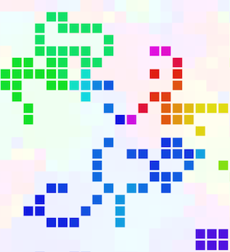
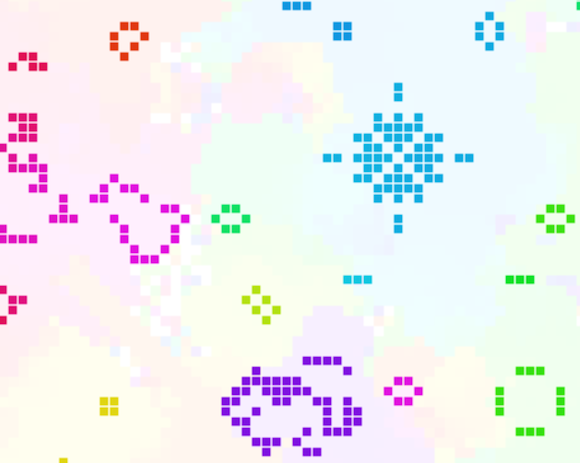

[Here's a web-based version](1) of Conway's Game of Life. The rules are the
standard recipe but I've added colour a color effect to the cells. At startup
the cells are assigned colors with random hues. Newly-created cells take the
color most similar to the neighbouring cells. When cells die I leave a trace of
their color in the vacant cell background.

Adding color makes the simulation more striking, and it also vividly illustrates
how local patches of the simulation share common ancestry.

About Life
==========

[Conway's Game of Life](2) is a wonder of mathematics. Invented by mathematician
John Conway in the 1970s it isn't really a game but a simulation experiment
involving squares in a grid ('cells') that are either 'live' or 'dead'. Any
live cell without two or thee neighboring live cells (including diagonals)
becomes a dead cell on the next turn (or 'generation'). Any dead cell with three
neighbouring live cells becomes live on the next generation.

From those very simple rules arises a fascinating array of complex behavior. The
menagerie of structures and creatures that can emerge has been studied
continuously since Conway invented his game. You can read all about Oscillators,
Spaceships, Reflectors and more on [LifeWiki](3) and elsewhere. The small
library of Life shapes that I include in my simulation were borrowed from the
excellent resources on LifeWiki.

Demo
====

[My demo](1) is written in JavaScript and uses canvas for the graphics. You can
vary the size of the grid and the update rate with the links at the top of the
page, as well as toggle the color effect.

When a cell is newly-created a hue is determined which is formed by summing a
2D vector for each of the three live neighbours' hues; representing the position
on the circumference of a circle where the angle represents the continuous hue
value. The hue of the new cell is taken as the angle between the origin and the
end of the combined vectors (using Math.atan2). This way an 'average' can be
obtained that does not tend towards any locality on the color spectrum.

The source is available on [GitHub](4) and has a GNU license.

As always, any comments or enquiries are welcome here or at
jimblackler@gmail.com.

[1]: http://jimblackler.net/life
[2]: http://en.wikipedia.org/wiki/Conway's_Game_of_Life
[3]: http://www.conwaylife.com/wiki/Main_Page
[4]: https://github.com/jimblackler/lifedemo